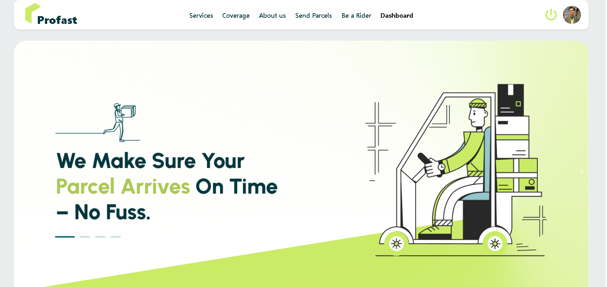
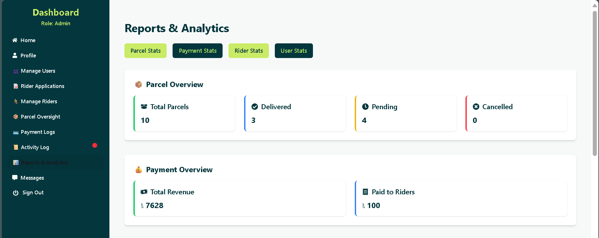
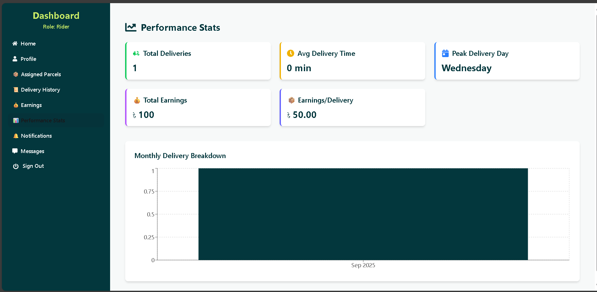
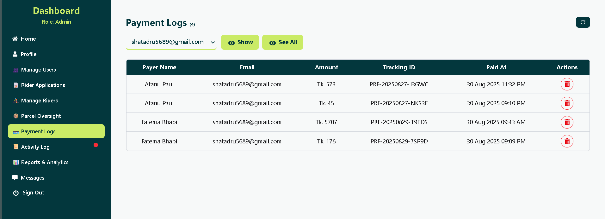
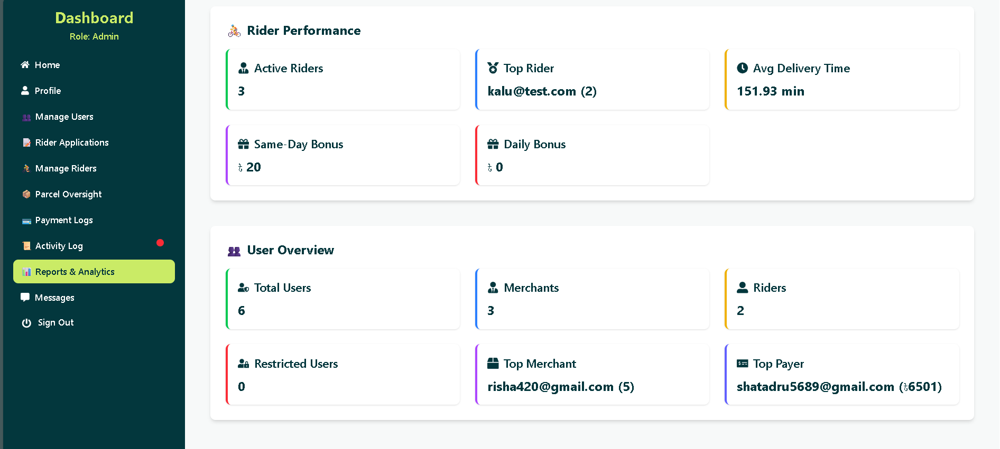

# 📦 Profast — Smart Logistics Platform


Welcome to **Profast**, a modern logistics and parcel delivery platform built for speed, transparency, and operational excellence. Designed for merchants, riders, and admins, Profast offers real-time tracking, secure workflows, and intuitive dashboards.

---

## 🌐 Live Demo & Backend

🔗 [Visit Profast Live](https://profast-7fb3a.web.app/) 

🔗 [Link to Backend](https://github.com/Atanu-paul89/Profast-server)  

---

## 🚀 Features

- 📍 Real-time parcel tracking with status updates  
- 🧾 Rider earnings breakdown and performance metrics  
- 📊 Admin analytics dashboard with visual insights  
- 🔐 Secure authentication and role-based access  
- 🎉 Welcome animation on first visit using Lottie  
- 📦 Parcel management with payment integration  
- 💬 Customer reviews and FAQ section  
- 🧠 AOS-powered animations for smooth UX transitions  

---

## 👥 Role-Based Functionality

| Role      | Capabilities                                                                   |
|-----------|------------------------------------------------------------------------------- |
| 🧑‍💼 Merchant | Create & Manager parcels, Apply to be Rider, Make Payment & track payments, Manage Profile  |
| 🚴 Rider     | View assigned parcels, track earnings, update delivery status, Manage Profile|
| 🛡️ Admin     | Manage users, monitor system logs, view analytics, approve/reject rider requests, restrict riders, manage parcels and full control of database  |

---

## 🖼️ Screenshots

### 📊 Reports & Analytics  


### 🚴 Rider Stats  


### 💰 Payment Overview  


### 👥 User Stats  


### 🎉 Welcome Animation  


---

## 🛠️ Tech Stack

- **Frontend**: React, Tailwind CSS, DaisyUI, Framer Motion, AOS, Axios
- **Backend**: Express.js, MongoDB, Cloudinary   
- **Auth**: Firebase Authentication  
- **Animation**: Lottie  
- **State Management**: TanStack Query  
- **Routing**: React Router v6  

---

## ⚙️ Installation & Setup

```bash
git clone https://github.com/Atanu-paul89/Profast-client
cd profast
npm install
npm run dev

*** Make sure to configure your .env file with Firebase and MongoDB credentials. 

📁 Folder Structure
Code
src/
├── assets/              # Images, Lottie files
├── components/          # Reusable UI components
├── pages/               # Route-based views
├── router/              # React Router setup
├── Auth/                # AuthProvider and context, firebase
├── hooks/               # Custom hooks
└── main.jsx             # Entry point 

🧠 Developer Notes
- AOS animations are refreshed on route change via RootLayout.jsx
- Welcome animation shows only once per session using sessionStorage
- All stats components are modular and API-driven
- Admin dashboard is fully responsive and scalable 

📞 Contact
📧 shatadru5689@gmail.com 
📍 Chattogram, Bangladesh 

✨ Thank you for exploring Profast. Let’s deliver smarter, faster, and better.
